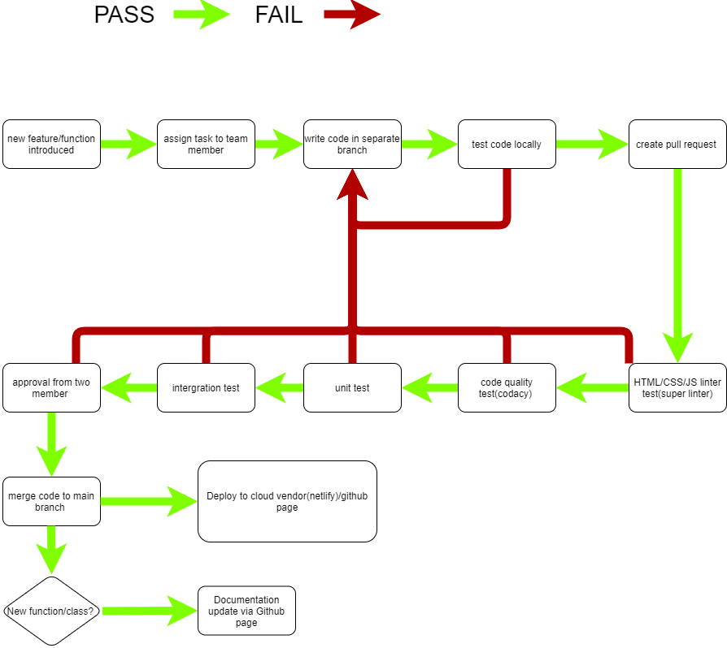

# phase1 pipeline status #

## pipeline diagram ##

## task assginment ##
- We are holding two sprint meeting each week, one is on Tuesday, the other one is on Thursday.
  - On the sprint meeting, we will discuss what are the main features/functions we want to implement for next week.
  - Also, we will review the task we assign from last meeting, and check if there is anything that are still working in progress.
  - After that, we will separate team membes into groups of two for peer programing, each group have their own job.
 
## project implementation ##
- Directly committing code to main brand is forbidden for core file, such as html/css/js files for our web app.
- All members need to create their own branch and pull from main branch before writing their own code.
- Member are highly recommanded to use linter locally before upload code to github and before creating a pull request.

## create a pull requset ##
- Team members need to answer two questions and include a screenshot of their change before submitting there pull requests.
  - Q1: What changes did you make?
  - Q2: How did you ensure that your changes work?
  - Q3 : Screenshot of the change.

## linting test ##
- We use superlinter as our main tool for linting test.
- Linting test will happen after a team member created a pull request.
- Linting will test any updated HTML/CSS/JS files.
- TODO:
  - Right now, all tests are running under default setting, we should make our own configuration file.
  
## Code quality test ##
- We use Codacy as our main tool for code quality test.
- TODO:
  - Right now, all tests are running under default setting, we should make our own configuration file.

## unit test and intergration test ##
- Unit test and intergration test are now checking two functions of our web app.
  - Test 1: Check if home page have thumnails of recipes.
  - Test 2: Check if three time limit buttom is functioning.
  - Test 3: Check if the search bar is functioning.

## approvals from two members ##
- Approvals from two members are mandatory for all pull requests, except emergency.

## Deployment ##
- Auto deployment will happen via Github page/Netlify each time codes from pull requests are merged.

## Documentation ##
- All JS documentations are located inside docs directoty.
- Any update from JS documentations will be detected and the documentation page will be update automativectly.
